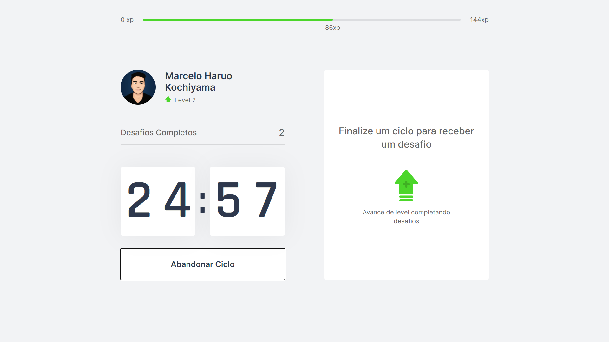
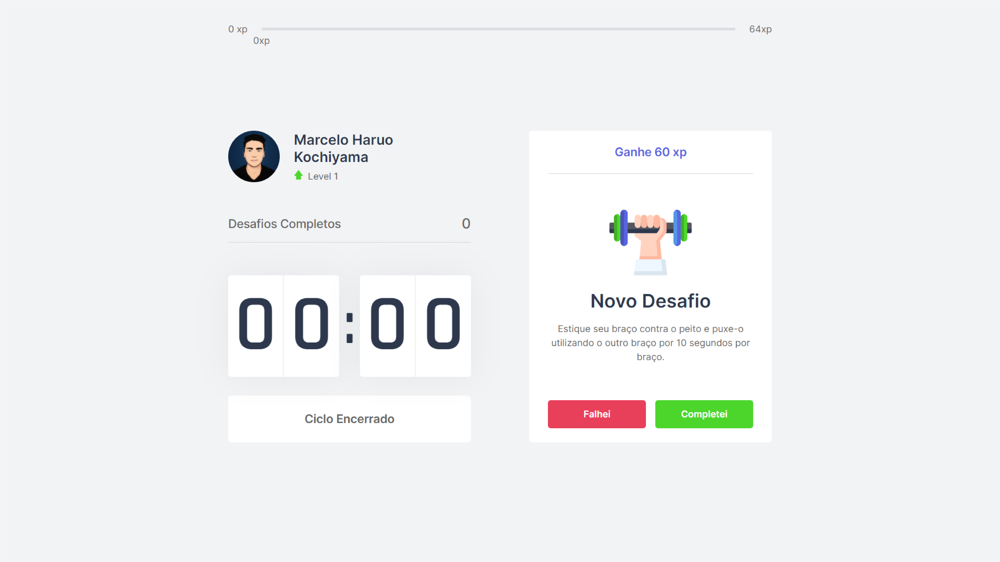
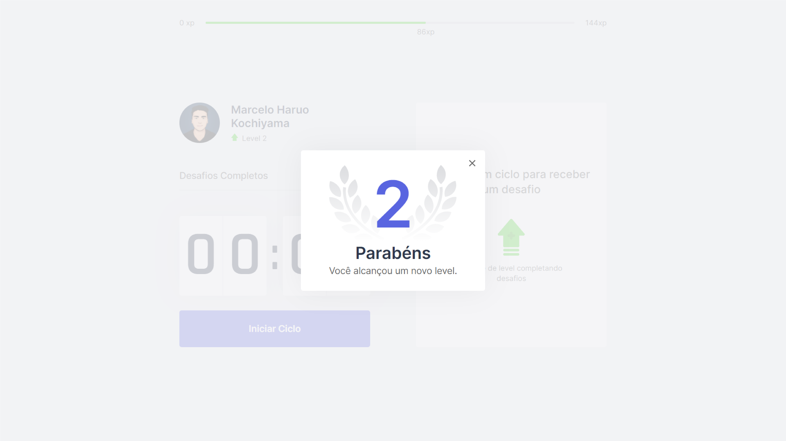

# [MoveDoro](https://movedoro.vercel.app/)

MoveDoro is the tool to help you to have a healthy routine while using your computer, using the Pomodoro Technique. MoveDoro is based on cycles of 25 minutes, after the end of one cycle, an challenge will show up. The challenges are simple physical exercises to improve your body and vision health.

Every completed challenge gives you an amount of experience, used for leveling up.

# Techs

This project was developed with:

- Next.js
- ReactJS
- Typescript

## Try [MoveDoro](https://movedoro.vercel.app/) now!

### Running Cycle

### Challenge

### Level Up

## Run locally

This project is open source, you can run it on your own computer and change it like you want.

### System Requirements

- NodeJS v14.15.5
- Yarn v1.22.5

### Steps to run locally

1. Clone this repository;
2. run `yarn` on terminal inside movedoro folder;
3. run `yarn dev` to start up the next.js local server;
4. Open http://localhost:3000 on your browser;

That's all for running this project on your machine

# Contribute

If you have found a bug or have an idea to improve this project you can send an email for marcelokochiyamadev@gmail.com or create a new issue.

# Roadmap - Aditional Features - On development application

- [x] Store data on database
- [x] New UI style
- [ ] Themes
- [x] User login and Authentication
- [ ] Profile Page
- [ ] Profile Editing
- [ ] Settings - custom time
- [x] Leaderboards
- [ ] Share leveling up image on social media
- [ ] Add more challenges
- [ ] Achievents

# Roadmap - Aditional Features - Depployed

- [ ] Store data on database
- [ ] New UI style
- [ ] Themes
- [ ] User login and Authentication
- [ ] Profile Page
- [ ] Profile Editing
- [ ] Settings - custom time
- [ ] Leaderboards
- [ ] Share leveling up image on social media
- [ ] Add more challenges
- [ ] Achievents

# acknowledgments

This project was initially developed at an event called Next level Week, edition 4.

So a THANK YOU VERY MUCH @rocketseat and @diego3g for the event, it was an incredilble week!

After the week I'm adding more features and functionalities, letting it on my style and more.

# License

[GNU GPLv3](https://www.gnu.org/licenses/gpl-3.0.en.html)
